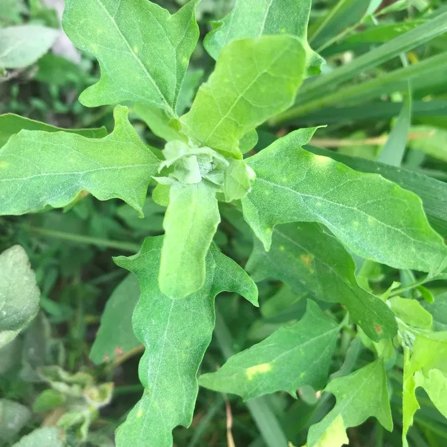
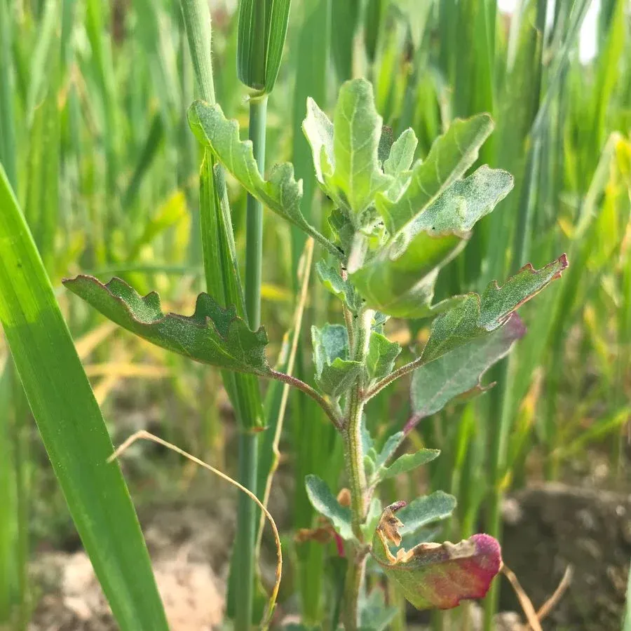
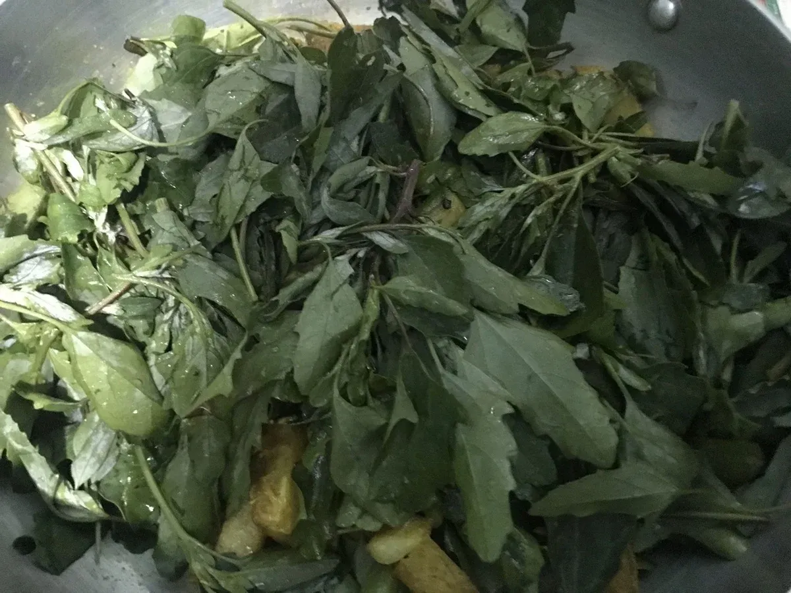

+++
title = "We collect Lamb's Quarters (Bethe ko Sag)"
date = 2024-01-29
lastmod = 2026-02-24
summary = "Bethe ko Sag (Lamb's Quarters) can be promising alternative food for the world while Nepalese have been cooking it since eternity."
categories = ["Organic Life", "Nature Education"]
+++

I have been collecting Lamb's Quarters (in Nepali: Bethe ko Sag) to cook as a one-off curry for my family dinner. Though it tastes quite strong, this wild herb can add vital nutrients to your Nepali-style meal.

<figure>

 <figcaption>'Bethe ko Sag' flourishes in perfect symbiosis with wheat cultivation.</figcaption>
 </figure>

 

Collecting 'Bethe ko Sag' has been an [outdoor nature activity](/posts/nature-activities-kids/) of my family during and after the winter. Kids love it to the moon and back.

<figure>

 <figcaption>I usually cook 'Bethe ko Sag' as I do with normal Nepali spinach curry.</figcaption>
 </figure>

 Doing things together out in nature, we (as adults with life-sized experiences) share our childhood memories which turn out to be valuable to the younger ones. It is quite a good socializing (and learning) opportunity for people of all ages. This activity also instills awareness of climate resilience with alternative food sources.

The embodied experience of venturing out, appreciating nature and natural elements (including this herb), doing things together with adults and other kids, cooking, and eating (this wild herb) enrich the learning experiences of the younger ones.

The open spaces in the neighborhood are gradually vanishing to the expanding built-up areas. Otherwise, one can find abundant Lamb's Quarters, growing wild in their localities in Nepal and diaspora.

