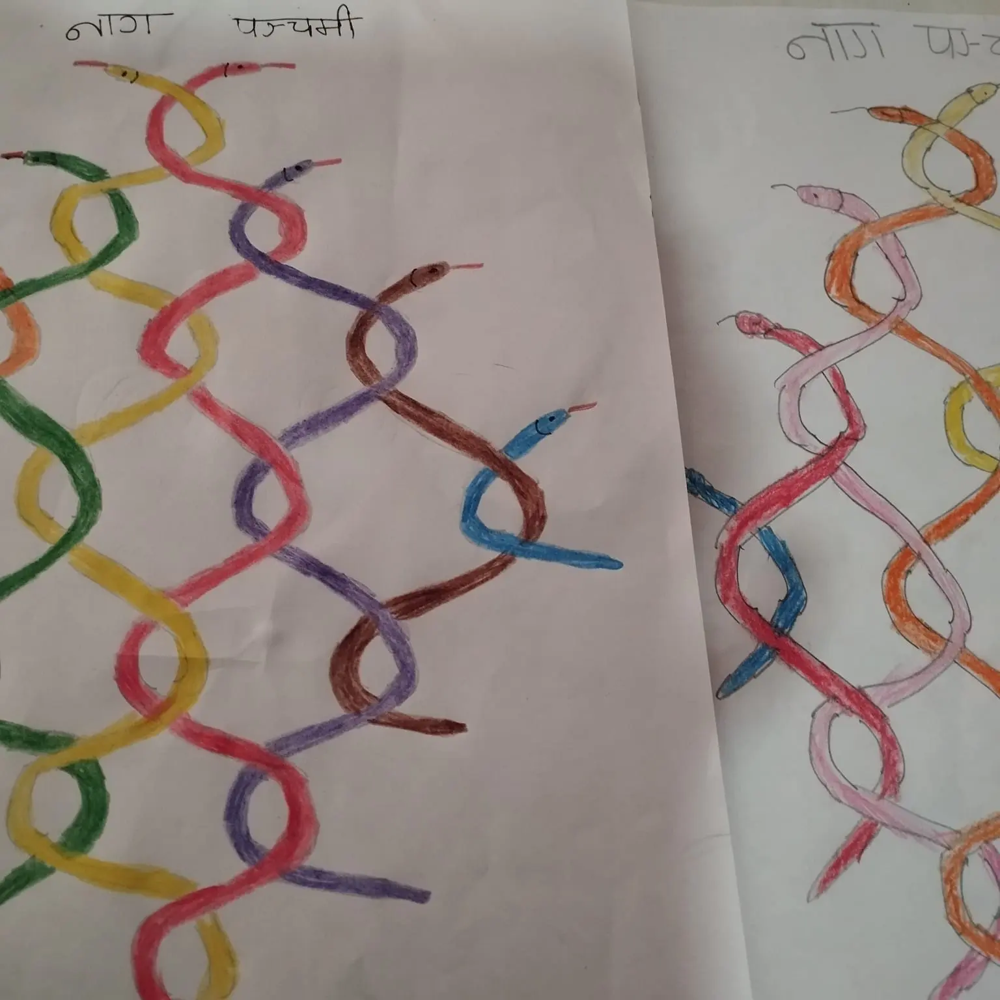

+++
title = "My Kids Handmade Nag Panchami Posters"
date = 2026-08-20
summary = "Another blog post about engaging kids at home."
categories = ["Activity-Based Learning"]
+++

It was my partner who first taught my kids and me to draw Nag Panchami posters at home.

In previous years, when the kids were younger than this year, we used to help them to make Nag Panchami posters and paste above our door frames.

> Nag Panchami is the festival of Hindus to worship Nagas - the serpent gods. On this day, they paste the pictures of Nagas above the door frame of main entrance of their house. Hindus believe that Nagas protect the humankind from adversities of the nature.
{icon="info"}

This year, our kids surprised me. They took their initiatives to draw the posters, color them and paste them. Definitely, my partner had to help them.

While talking about Nagas, our kids go to the state of immersing deeply in the stories of our folklore that support the animist beliefs of the wider society; and finally return back to daily life.