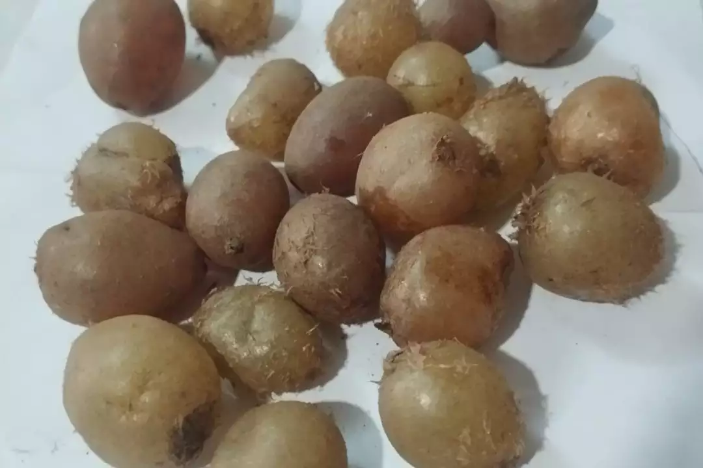
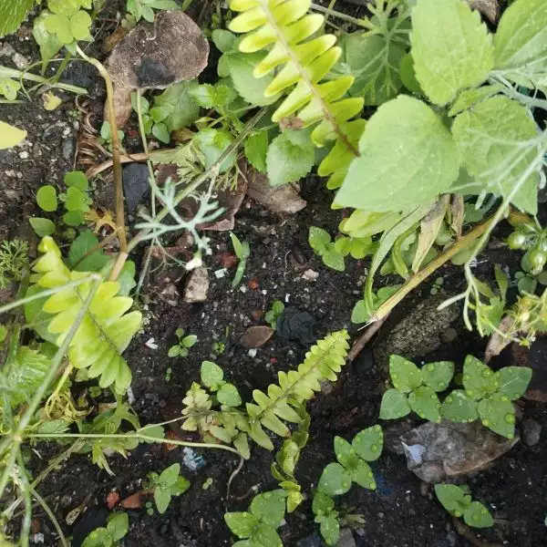

+++
title = "Growing Himalayan Ground Gooseberry (Pani Amala) - Tuberous Sword Fern"
date = 2026-06-13
summary = "I did not expect that in my lifetime I would grow a fern in my garden."
categories = ["Gardening"]
+++

It was not expected at Ason Bazaar. A street vendor was selling Pani Amala (Himalayan Ground Goosebery).

As my kids were already fan of this underground juicy tuber of a kind of fern native mostly on the himalayan foothills, I was determined to grow this fern in my garden.

I decided to buy the brown tubers from the vendor. Those arrived home, straightforwardly sowed in the poly bags.

<figure>

 <figcaption>Hill hikers in Nepal are seen eating such fern tubers saying it provides quick energy and hydration.</figcaption>
 </figure>

It took quite some time for the tubers to grow fern leaves from them. In fact, many of them decayed and only few of them were successful. Then, I transfered those into another garden pot.

<figure>

 <figcaption>Have I crossed the threshold by trying anything - even a wild fern?</figcaption>
 </figure>

Anyways, thank you for reading yet another garden blog post.

