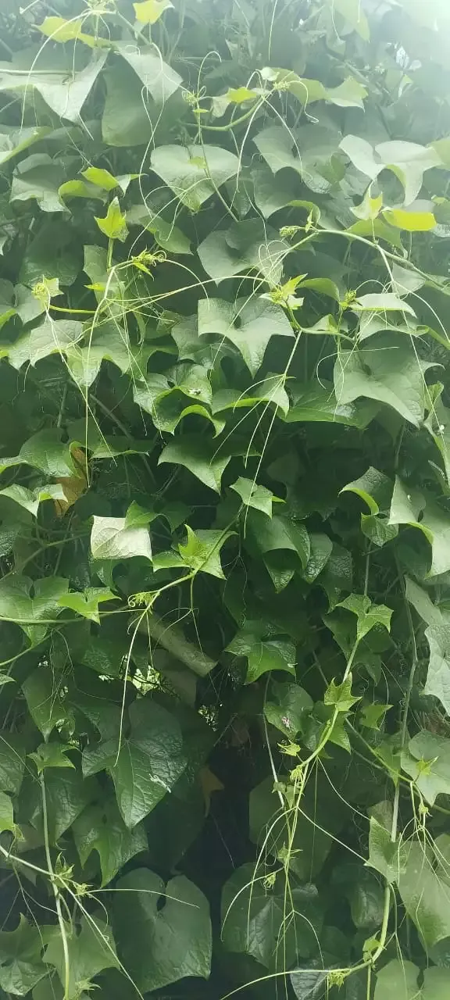
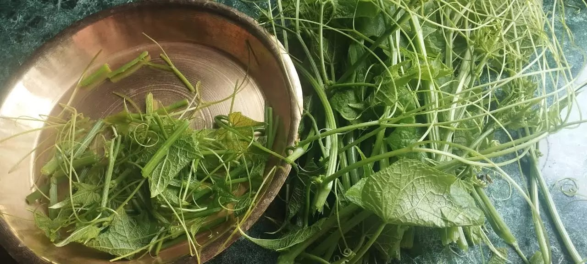
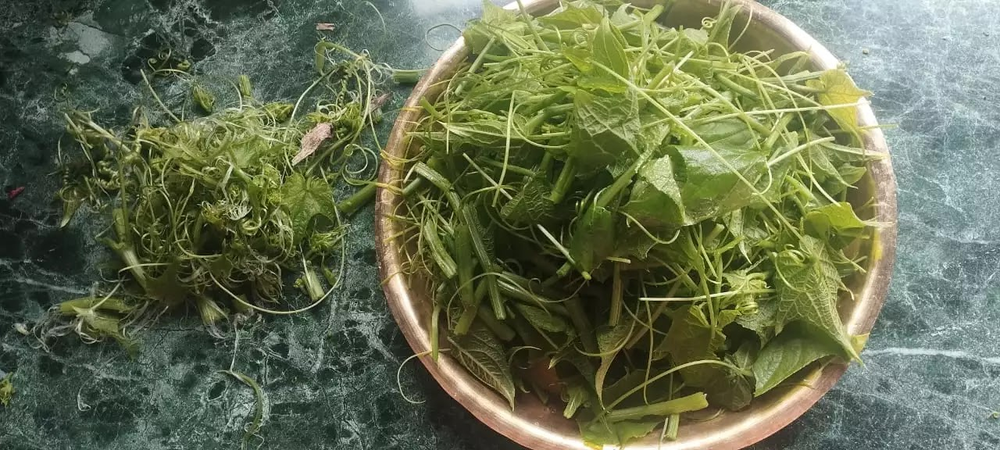

+++
title = "Iskus ko Munta: Tender Chayote Shoots - Vegetable in Abundance"
date = 2025-09-22
lastmod = 2026-02-19
summary = "Chayote gourd had been a readily available source of food in Nepal. Somehow forgotten, chayote ('Iskus' in Nepali) has been mighty in my garden."
main_image = "cleaning-chayote-shoots.jpg"
categories = ["Organic Life"]
+++

Well, I can not be so much certain about the nutritional guarantee of chayote for most of this squash's content is water. However, reports have been emerging that this backyard (a tree-climber vine) plant species can be considered as viable vegetable source in terms of food security.

<figure>

 <figcaption>Chayote gourd had been a readily available source of food in Nepal. Somehow forgotten, chayote ('Iskus' in Nepali) vine has been standing mighty in my garden. You can see it covering a tree in this picture..</figcaption>
 </figure>

In Nepal, we call it Iskus. I have avid memory of my childhood when I had been witnessing women of Kathmandu's fringes who used to get up early in the morning to sell a doko-full (a bamboo-basket that they used to carry on their back) of chayote squashes in the urban areas of Kathmandu. These days, as the urban people have been exploring various other food sources, Iskus is almost getting forgotten. People tempt to ignore this squash also because it is somehow bland in taste.

Hence, I thought that I should write a blog post about Iskus. Particularly, this time we have been harvesting it's delicate shoots and using as green vegetable that can be cooked as a curry. By curry, please do not imagine spicy Indian curry-like outlook. In Nepal, we mostly cook vegetables with minimal adding of spices.

Chayote provides food sources via its main fruit (the squash itself), tender shoots, and its tuberous root. My family is more fancy with its tender shoots and the squash itself. We have not tried its tuber.

Let me elaborate how we prepare tender chayote shoots before cooking.

First, we wash the harvested shoots. Then we tear the shoot's covering fibers that would be really difficult to be digested by humans. In Nepali we call this process as 'munta kelaune'. Then we wash the outcome once again. Then we cook the tender chayote shoots in small amount of oil, on an open pan in mild heat for considerable amount of time.

<figure>

 <figcaption>Cleaning chayote shoots</figcaption>
</figure>

<figure>

 <figcaption>Chayote shoots almost cleaned</figcaption>
</figure>

