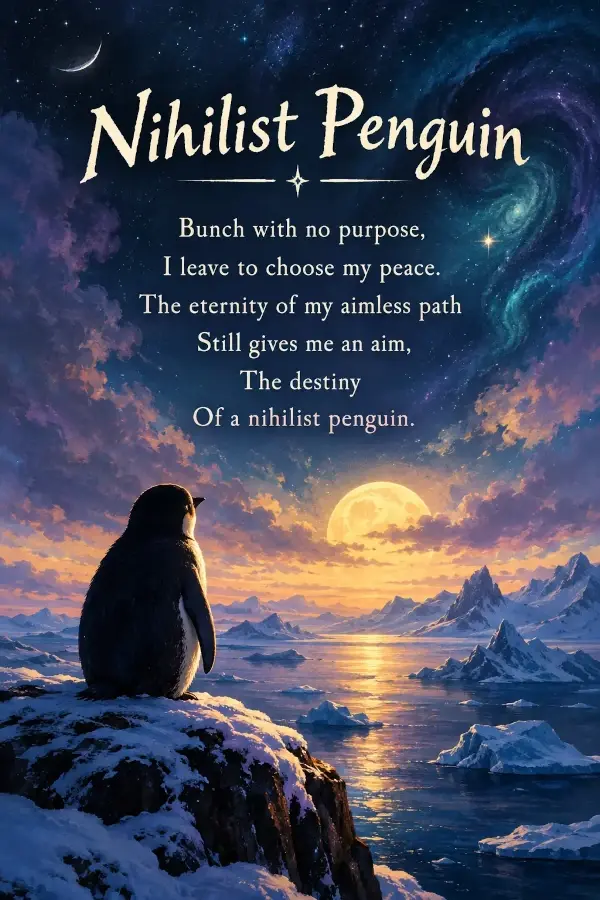

+++
title = "Poem on Nihilist Penguin"
date = 2026-09-07
summary = "I keep the reason writing this poem to myself. However, my readers may definitely get it."
categories = ["Poem"]
+++

Bunch with no purpose,  
I leave to choose my peace.  
The eternity of my aimless path  
Still gives me an aim,  
The destiny  
Of a nihilist penguin.