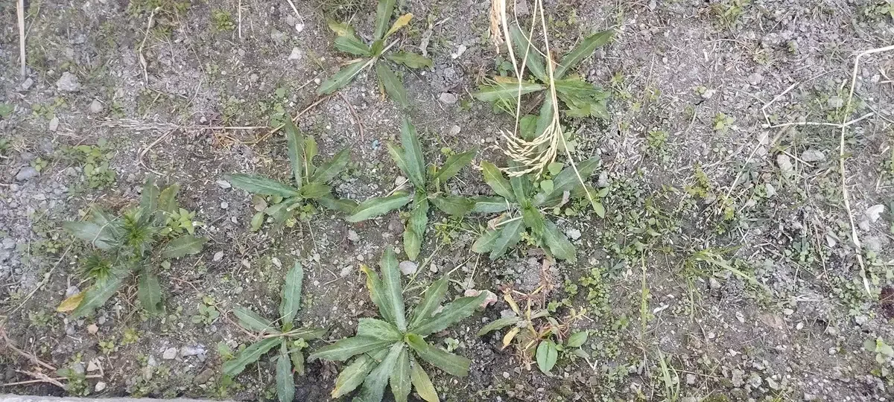
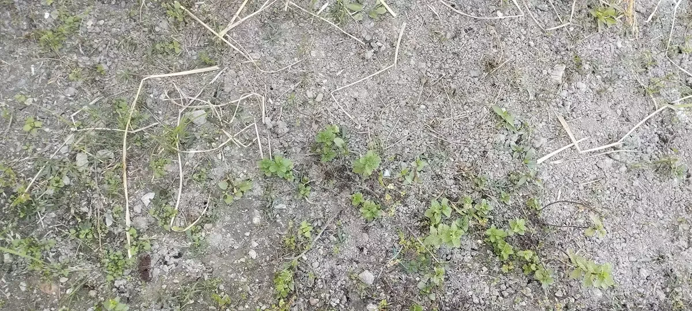

+++
title = "School Herbal Garden of Resilience"
date = 2025-10-24
lastmod = 2026-05-09
summary = "Despite being a short-spanned, this project got attention of the school management and made them enthusiastic on having nature education projects at the school."
categories = ["Nature Education"]
+++

On the onset of summer of 2025, we got a small rectangular plot of land on an edge of the school's paddy field. The project aimed to get the enthusiasm of the kids to work on something that would make them realize their own agency in reclaiming the natural connection, moreover, the symbiosis of the human and the natural elements.

Some boys showed interest and joined the club, as it was announced as the 'School Herbal Gardening Club'. The club would work on the herbal garden during the 'Exploratory Blocks' and other needful times as well.

On the first day, we worked together to make the soil bed. The boys were not prepared for this. However, since they were voluntarily in, they could not seek other options - at least they did not ask for a change despite the fact that they already showed uneasiness working on the soil. To me, that was really a radical programming for getting hands back to nature, the ones that were used to the flashy dopamine triggers (I mean digital devices). Together, we dug the soil, removed the weeds, and prepared the soil bed for herbal plantations. 

After a fortnight, the soil bed was already full of wild weeds. We again had to prepare it on the same day - we planted herbs like [culantro](/posts/nepali-kade-dhaniya-culantro/), strawberry plants, mint, lemon grass, and we also sowed some seeds of various legumes.

Gradually, the South Asian monsoon began to hit really hard; our herbal garden was waterlogged. The school planted paddy on the other side, which mostly remains tilled with water. I learned that I should do such projects on raised beds with no water-logging. 

Consequently, I had to take the boys to another exploratory project as ours was hampered by the weather (and soil) conditions. If the day was not wet, I would ask the boys to work in some way in the garden - for example, to drain the water off. Despite all odds, culantro and mint survived. Had the herbs grown to some satisfactory extent, I would have asked them to do some pruning.

One day, I helped them do individual SWOT analyses of the project that was already started and was almost in limbo. For external factors, I also introduced PESTLE analysis. The boys really showed contemplative capabilities while working on these. As an environmental educator in a country that has removed environmental science/education as a mandatory school subject, I felt that I carry some agency in environmental education.

I found that the project meant a lot for the boys. One boy had written "I think that the future of herbal gardening at (school's name) is good, as the rainy season is ending, but a volleyball court might be built on the garden. But we may get a better place and landscape".

I think that environmental education and inculcation of enthusiasm in kids should be really working when the 'home' shares enthusiasm and pragmatism in partnerships/communication with the school. One of these boys was found to be conversing about the project with his family. They sent some seeds for the garden (that failed, of course, because of waterlogging) and also expected some saplings of culantro if we could propagate well in the school's herbal garden.

As an environmental educator with no 'hopelessness', I am currently reevaluating and juxtaposing my EE efforts. I do nature education stuffs also with my own kids, who do not study at the same school. While acknowledging that environmentalism should scale up, and should instill extensive reorientations among people's lifestyles/livelihoods and economies in this world, I decided to provide a catchy topic for my blog post - School Herbal Garden of Resilience.

