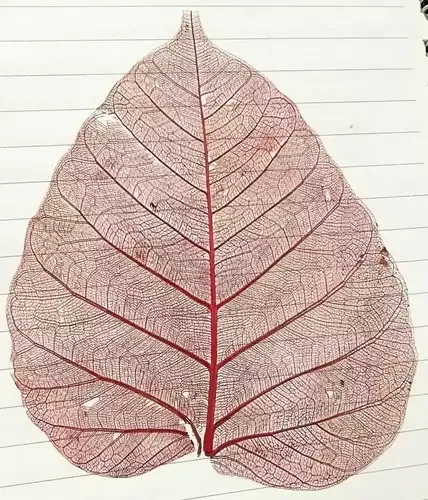

+++
title = "Papa Don’t Preach: How a Treasure Hunt Worked Better Than Rules to Reduce Screen Time"
date = 2026-02-22
summary = "Sometimes, the most effective pedagogy begins not with instruction, but with a simple act: turning off the devices and playing real non-digital games."
categories = ["Activity-based learning"]
+++

It was nothing special about waking up - just a normal, slow morning. She woke up late as if we have a gentle agreement at home - that clock is irrelevant during the holidays.

A teenager is mostly away from parents even if they are home. I also acknowledge their wish to remain independent and have non-authorative parents. That morning, while I was preparing a cup of coffee, I found that she had already settled in front of the TV - watching brainrot contents from YouTube. I was raged inside already as a father of flesh and blood - I must say. Being determined to adopt different approach, I went to the balcony and set the mat under the winter morning's sun.

A bit later, I called her to join me for sunbathing. She did not respond. Hence, as soft objection against her behavior, I used my phone to change the password of WiFi.

A minute later, she appeared in front of me - smiling.

We sat together in the sun. I wanted to converse with a teenager child, with gradual approach. Initially, she was already showing withdrawal signs as she wanted to continue watching the TV. In such situation, the approach would be even more difficult, as I stiffened myself against providing the new password. She slowly shifted her focus from the TV to the real world - the mat, father, plants, the sun, and the winter breeze. Still, she would already be withdrawing from such situation and would ask me to tell her the new password.

We conversed about the things that would make her interested or keeping up conversing with the father - till a bit later. I observed that she had frequent peaks on longing to get internet connection to the TV. However, I convinced her to stay away from any form of screen till the lunch.

After the lunch, I proposed a game - treasure hunt!

My child seemed eager and interested on it. I told her that I would let her know the new password, only if she is able to get to the 'treasure'. In fact, my plan was to provide the password as the final thing she gets as 'treasure'.

I created cues related to various topics such as healthy suggestions to a teenager, personal decency, sleep time for a teenager, self disciplining, healthy food, healthy beverage, and importance of family. The final discovery would be the password iteself. Every cue made her think, contemplate, and keep moving - both physically and mentally.

She needed, at some instances, some help to get to another milestone of the treasure hunt. Finally, she made it. It seemed like she already liked it. I heard her saying - "I will make little bro play this".

To my surprise, I saw her beginning to make an instant treasure hunt - for me to play. At first, I was not ready. Again, I thought that I must be a supportive father. I obeyed her and went to the rooftop so that she could plan it better - preventing me from knowing any hint already.

Later, she called me. I began the hunt. To her surprise, I completed it in 4 minutes. The 'treasure' was a splendid artwork made by her. It was a peepal leaf skeleton: only the veins remained, delicately colored red.

I asked her who had taught her this technique.

“YouTube,” she said.

The joy of the trasure hunt — thinking, moving, and creating — had already done its work. Later, during the daytime, she was reading the book, watering the garden, asking questions, and painting - father being at her side.

I appreciated her artwork. I appreciated her works - more verbally - the treasure hunt. She seemed really content that her father acknowledged her creativity.

That day, even after getting the WiFi password, she barely turned to the devices.

Not because they were forbidden — but because she felt good doing something else. ✍️

