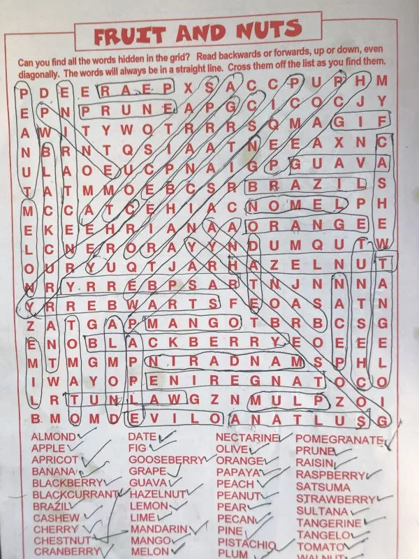

+++
title = "Word Search Grid: Spending Quality (and Quantity) Time with Kids"
date = 2024-02-07
summary = "Sit next to your kid for word search grid, your bond matters most in life!"
categories = ["Activity-based learning"]
+++

Earlier this week, one of my kids found a word search grid on the back pages of a notebook. We then decided to play a game together.

In fact, it was not a competitive game. Rather, we used a cooperative approach.

All we had to do is find a word (at a time) by looking at the grid. We were not allowed to cover the page with finger or anything.

To be honest, it turned out to be quite competitive because one would be super pompous if s/he finds the given word at the earliest (sooner than others)!

The joy of the trasure hunt — thinking, moving, and creating — had already done its work. Later, during the daytime, she was reading the book, watering the garden, asking questions, and painting - father being at her side.

I appreciated her artwork. I appreciated her works - more verbally - the treasure hunt. She seemed really content that her father acknowledged her creativity.

That day, even after getting the WiFi password, she barely turned to the devices.

Not because they were forbidden — but because she felt good doing something else. ✍️

